# Civic-Station

[](https://github.com/Nu-AbdulRehman/Civic-Station/actions/workflows/ci.yml)
[](https://github.com/Nu-AbdulRehman/Civic-Station/actions/workflows/cd.yml)
[](https://github.com/Nu-AbdulRehman/Civic-Station/actions/workflows/release.yml)


[](LICENSE)

**Municipal complaint intake, AI triage and operations, built so the classifier can be replaced and
the system does not fall over when the classifier does.**

---

## The problem

Every municipality runs the same broken process. A citizen reports *"burst water main flooding
Street 12 since fajr, water entering ground floors"* into a form, and that free text lands in an
undifferentiated queue. On a Monday the queue is four hundred items long, and the burst main sits
behind three streetlight complaints because nothing sorted them. A category dropdown does not fix
it: citizens pick the wrong one, pick "Other" to get through the form, and cannot judge urgency.
The information is in the text, and somebody has to read it.

The engineering problem is not the reading. It is that **the reader must be replaceable**. Today it
is a keyword rule, tomorrow a language model, next year a fine-tuned classifier. The system around
it must not care which, and must not fail when the clever one is rate-limited, slow or simply wrong.

## What Civic-Station does

- A citizen submits a complaint (text, location, optional contact). It is validated, stripped of
  personal data, and **triaged into a category, a priority and a one-line summary**.
- The classifier is chosen by one variable, `TRIAGE_PROVIDER`: a hosted LLM (Groq), a local LLM
  (Ollama), keyword rules, or a deterministic simulator for tests. Every provider sits behind the
  same interface ([ADR-0001](docs/adr/0001-provider-interface.md)).
- **A provider failure never reaches the citizen.** Timeouts, rate limits, server errors and
  malformed output all end in the rules classifier, and the complaint is still accepted with
  `201`, marked `triaged_by: rules:fallback`. Complaint text is fenced off as data in the prompt,
  and a model that follows an injected instruction off the schema is rejected the same way
  ([`docs/TRIAGE.md`](docs/TRIAGE.md) §8).
- Operators work complaints through a fixed status workflow on a dashboard, and watch aggregate
  statistics served from a cache.
- It runs as cooperating containers on a laptop with one command, and as a probed, autoscaled
  workload on Kubernetes, deployed by a pipeline that tests, scans, publishes and can roll back.

## Contents

[Quickstart](#quickstart) · [Screenshots](#screenshots) · [Architecture](#architecture) ·
[Deployment](#deployment-diagram) · [Packages](#package-diagram) · [Activity](#activity-diagram) ·
[API](#api) · [Configuration](#configuration) · [Kubernetes](#kubernetes) · [CI/CD](#cicd) ·
[Testing](#testing-and-checks) · [Repository layout](#repository-layout) ·
[Documentation](#documentation)

---

## Quickstart

Needs Docker (Engine with Compose v2) and `make`. From a clean clone, **one command**:

```sh
make up
```

It copies `.env.example` to `.env` if there is none, builds both images, starts PostgreSQL and
Redis, runs the migrations and loads 30 seeded complaints through a one-shot `migrate` service,
starts the backend and frontend, and waits until every service is healthy. Then open
<http://civic-station.localhost:8080>. The default classifier is the keyword rules, so no API key is
needed.

Without `make` (plain Windows, for example), the same two steps by hand:

```sh
cp .env.example .env                 # PowerShell: Copy-Item .env.example .env
docker compose up -d --build --wait
```

`.env` is where Compose reads every credential (`POSTGRES_*`, and `GROQ_API_KEY` if you use Groq).
It is git-ignored, and `.env.example` holds placeholders only. The repository's GitHub secrets are
used by the CD workflow and never reach a clone.

**Choosing the classifier**

| Classifier | How |
|---|---|
| Keyword rules (default) | Nothing to do |
| Groq (hosted LLM) | In `.env`: `TRIAGE_PROVIDER=llm` and `GROQ_API_KEY=<your key>`, then `docker compose up -d --wait` |
| Ollama (local LLM, offline) | Once: `make pull-models` (downloads `llama3.2:1b` into a volume). Then `TRIAGE_PROVIDER=ollama` in `.env` and `docker compose --profile ollama up -d --wait` |

`docker compose down` stops the stack; `docker compose down -v` also deletes the data.

---

## Screenshots

Captured from the running stack through nginx, in both themes (the toggle is top-right; the first
visit follows the operating system's setting).

| | Light | Dark |
|---|---|---|
| **Submit**, with the triage result | 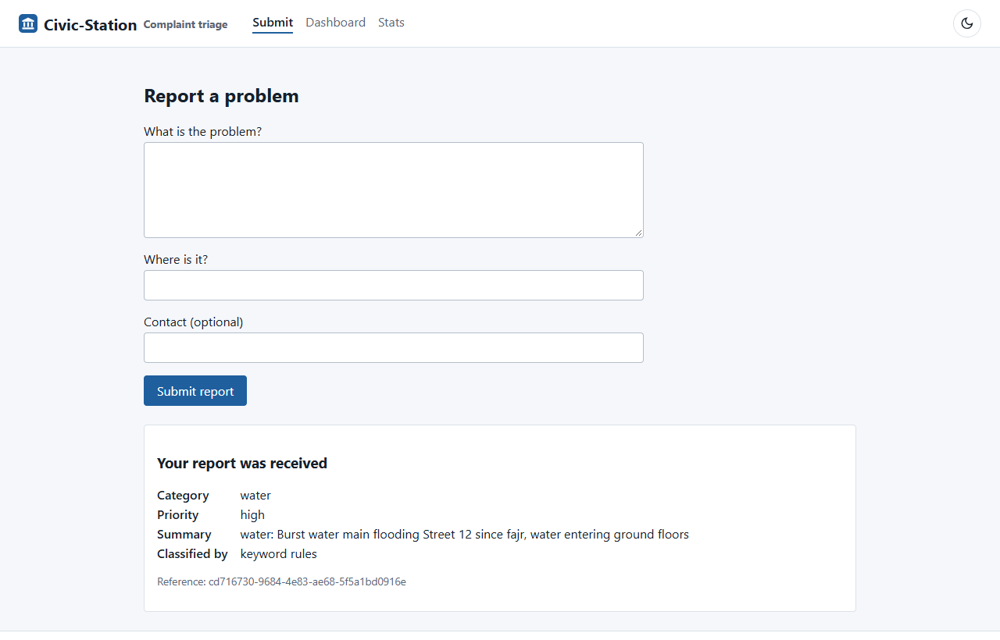 | 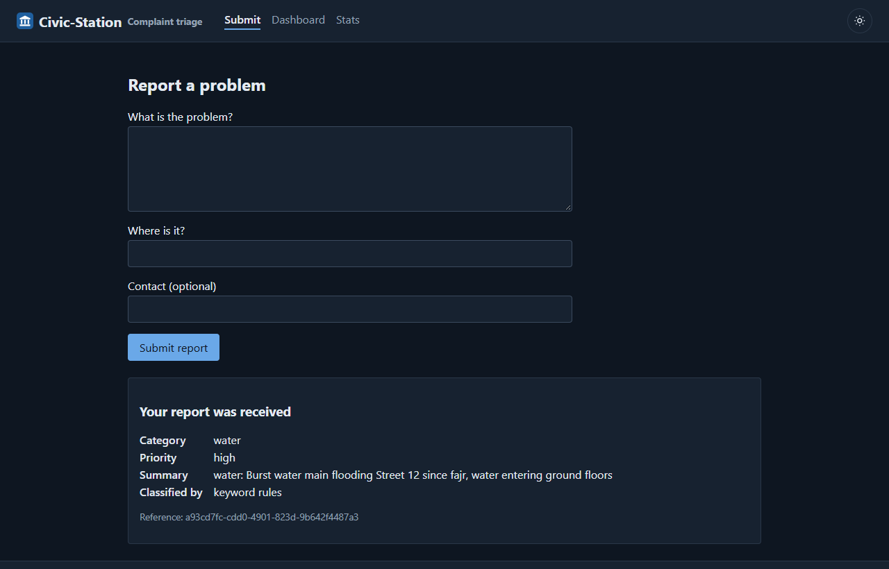 |
| **Dashboard**, filters, priority and status | 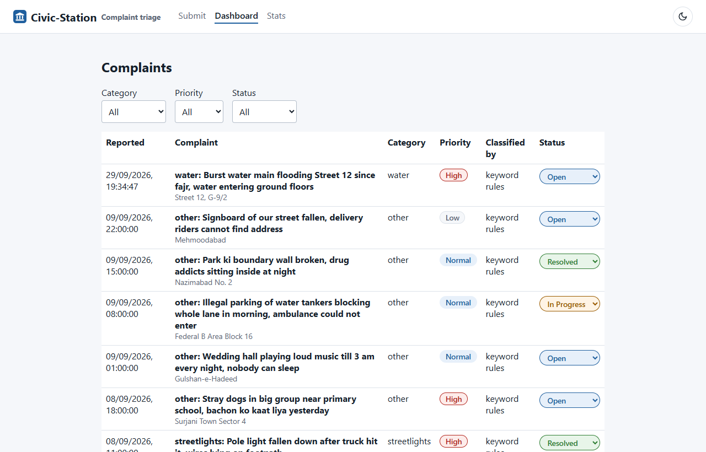 | 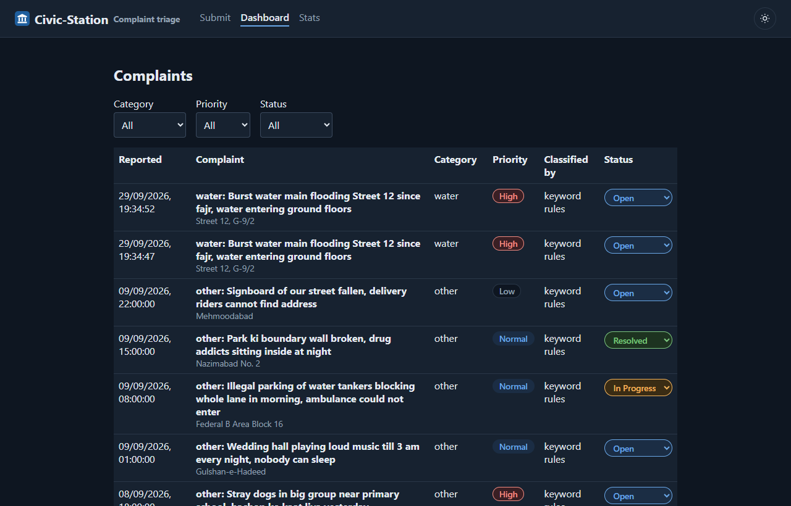 |
| **Stats**, served from cache (`X-Cache: HIT`) | 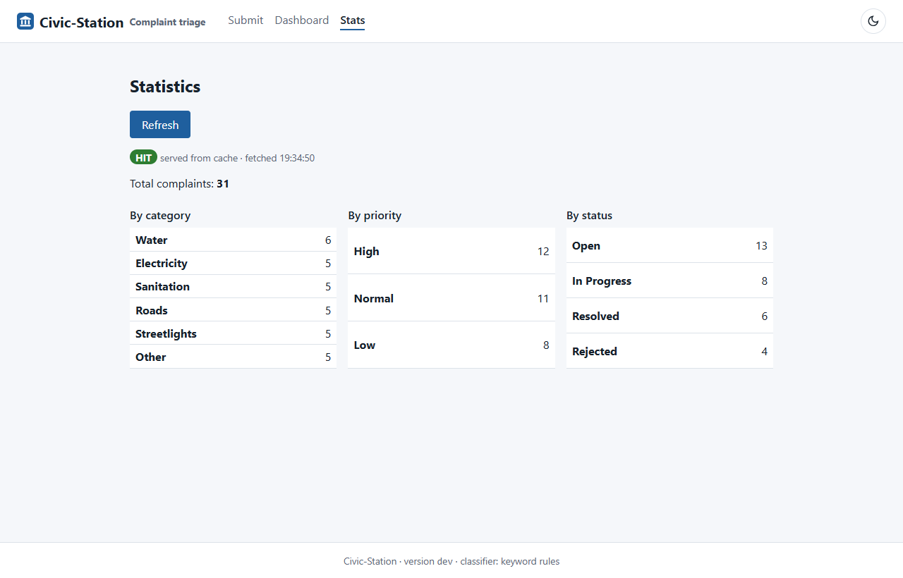 | 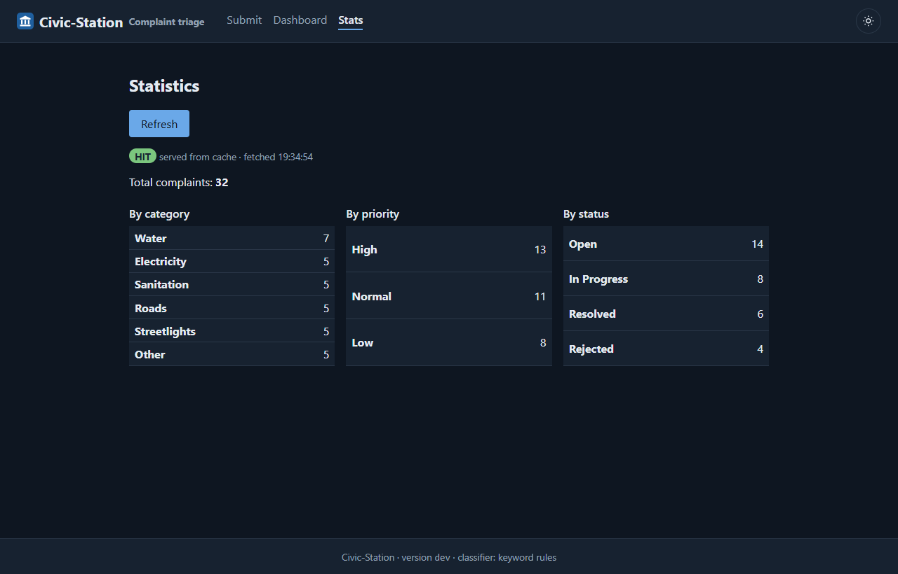 |

The dashboard offers every status and shows the server's own `409` message when a transition is
refused; see [`docs/evidence/dashboard.png`](docs/evidence/dashboard.png) for `resolved → open`.

---

## Architecture

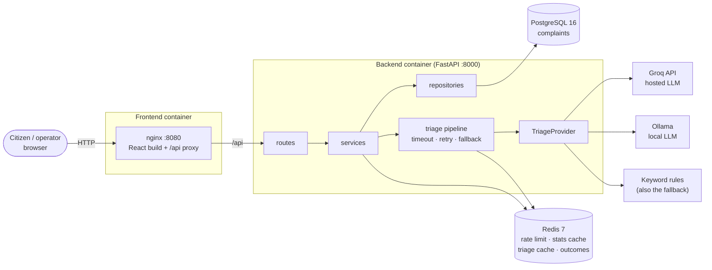

The browser only ever calls relative `/api/...` paths; nginx forwards them to the backend, whose
address is supplied when the container starts, so one image serves every environment
([ADR-0002](docs/adr/0002-frontend-runtime-config.md)). On Kubernetes the Ingress sends `/api`
straight to the backend Service.

The backend has four layers with one-way dependencies: routes do HTTP only, services hold the
business rules, repositories are the only place SQL is issued, and providers wrap every external
system. `scripts/check_submission.py` enforces the boundaries on every pull request.

---

## Deployment diagram

### Docker Compose (development and `compose.prod.yaml`)

Three networks ([ADR-0005](docs/adr/0005-network-topology-and-limiter-degradation.md)): the
frontend can reach only the backend, and the data services have no route to the internet. The
backend is the only container on more than one network.

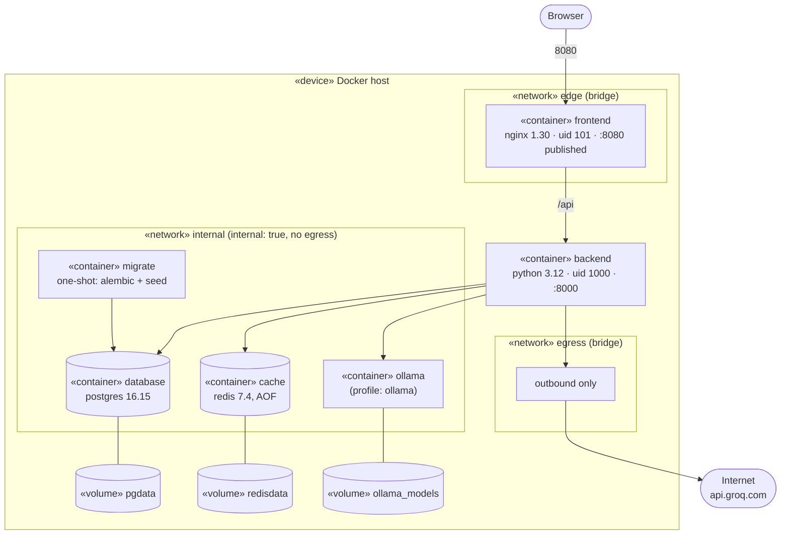

`docs/evidence/network-isolation.txt` shows `ping database` from the frontend failing with
`bad address`, while the backend reaches it.

### Kubernetes and the delivery pipeline

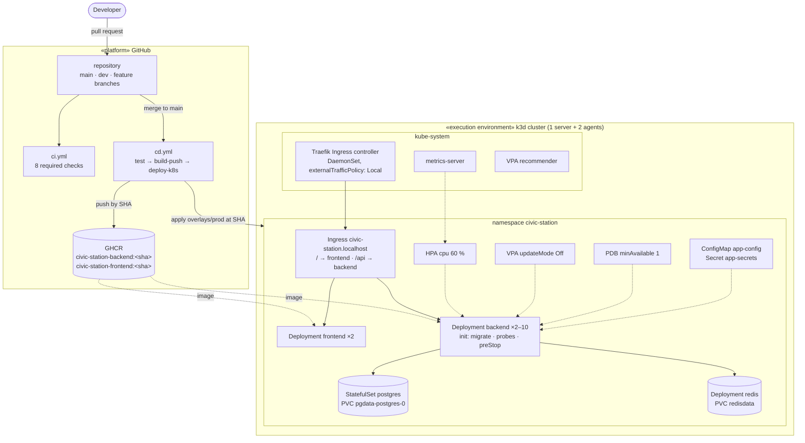

All four Services are `ClusterIP`; only the Ingress is reachable from outside. PostgreSQL is a
StatefulSet so `postgres-0` always reattaches its own volume
(`docs/evidence/k8s-postgres-persistence.txt`).

---

## Package diagram

Arrows point from a package to the package it depends on. Nothing depends on `routes`, and
`domain` depends on nothing in the application.

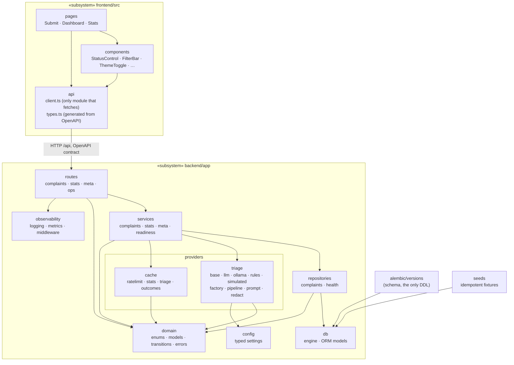

---

## Activity diagram

Submitting a complaint (`POST /api/complaints`). The retry, timeout and fallback live in one place,
`providers/triage/pipeline.py`, never inside a provider.

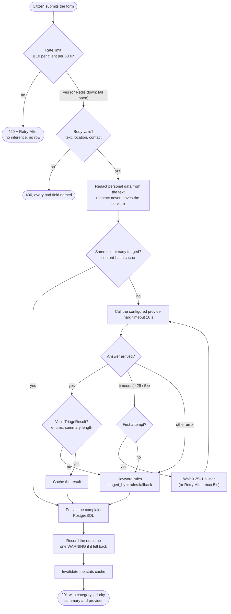

The status workflow operators drive from the dashboard is a lookup table, not a chain of `if`
statements (`backend/app/domain/transitions.py`). Anything else returns `409`, with the server's
message shown verbatim.

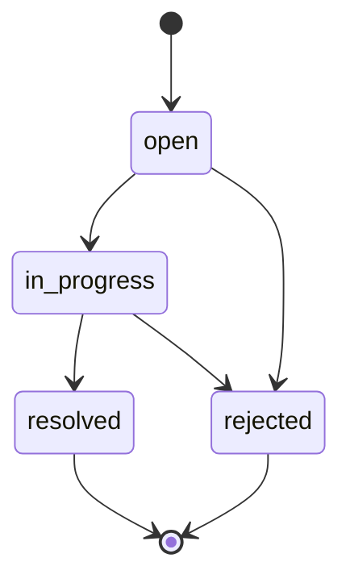

---

## API

Full contract: [`docs/design/01-api-contract.md`](docs/design/01-api-contract.md); live schema at
`/openapi.json` and `/docs` on the backend. Every error uses one envelope,
`{"error": {"code", "message", "fields"}, "request_id"}`.

| Method | Path | Purpose | Notable codes |
|---|---|---|---|
| POST | `/api/complaints` | Submit and triage | 201, 400, 429 |
| GET | `/api/complaints/{id}` | Fetch one | 200, 404 |
| GET | `/api/complaints` | Filter by category, priority, status; paginate | 200, 400 |
| PATCH | `/api/complaints/{id}/status` | Advance the status | 200, 404, 409 |
| GET | `/api/stats` | Aggregates, read-through cache for 30 s | 200 + `X-Cache: HIT \| MISS` |
| GET | `/api/meta/providers` | Active classifier and the last 20 outcomes with latency | 200 |
| GET | `/api/version` | Running commit SHA and classifier | 200 |
| GET | `/health` | Liveness; touches no dependency | 200 |
| GET | `/ready` | Readiness; checks database and cache | 200, 503 |
| GET | `/metrics` | Prometheus metrics | 200 |
| GET | `/openapi.json` | Schema | 200 |

---

## Configuration

One typed settings object reads the environment at startup; an unknown or invalid value stops the
process with the variable named. Full registry:
[`docs/design/00-conventions.md`](docs/design/00-conventions.md) §3.

| Variable | Default | Purpose |
|---|---|---|
| `TRIAGE_PROVIDER` | `rules` | `llm` (Groq), `ollama`, `rules` or `simulated` |
| `GROQ_API_KEY` | none | Required only for `llm`; never logged, never committed |
| `TRIAGE_MODEL` / `OLLAMA_MODEL` | `qwen/qwen3.8-27b` / `llama3.2:1b` | Pinned model names ([`docs/TRIAGE.md`](docs/TRIAGE.md)) |
| `TRIAGE_TIMEOUT_SECONDS` | `10` | Per-call limit; refused above 15 |
| `RATE_LIMIT_REQUESTS` / `RATE_LIMIT_WINDOW_SECONDS` | `10` / `60` | Per-client limit on `POST /api/complaints` |
| `STATS_CACHE_TTL_SECONDS` | `30` | Stats cache lifetime |
| `DATABASE_URL`, `REDIS_URL` | required | Composed from `.env` by Compose, from the Secret on Kubernetes |
| `APP_VERSION` | `unknown` | Commit SHA, set at deploy time, never at build time |
| `BACKEND_ORIGIN` | required (frontend) | nginx proxy target, read when the container starts |

---

## Kubernetes

A local three-node cluster with [k3d](https://k3d.io) (needs Docker, `k3d`, `kubectl` and a POSIX
shell; on Windows, Git Bash):

```sh
sh scripts/k3d-up.sh
```

It creates the cluster, configures Traefik to keep client addresses, installs the VPA recommender,
creates the Secret, builds and imports the images, and applies `k8s/overlays/dev`. Then open
<http://civic-station.localhost:8081> (demo data:
`kubectl exec -n civic-station deploy/backend -c backend -- python -m seeds.complaints`).

Manifests are Kustomize: `k8s/base/` plus `overlays/dev` (simulated classifier, halved limits) and
`overlays/prod` (Groq, image tags and `APP_VERSION` set to the commit SHA by the pipeline). The
committed `k8s/base/secret.example.yaml` holds placeholders and is never applied. Operations,
rollback and secret rotation: [`docs/RUNBOOK.md`](docs/RUNBOOK.md).

**Measured on the cluster** (all in [`docs/evidence/`](docs/evidence/README.md)):

| Claim | Result |
|---|---|
| HPA scales under load | 2 → 10 → 2 replicas; first scale-out 34 s after load; [chart](docs/evidence/run1-replicas-vs-load.png) |
| VPA loop | Recommended 182m against the 100m guess; requests updated; re-run compared |
| Zero-downtime rollout under load | 13,456 requests, 0 failed |
| Rate limiter is distributed | 4 replicas, 30 requests: exactly 10 × 201 and 20 × 429 |
| Rollback | `rollout undo` 22–25 s at production limits |
| Probes | Database stopped: pods leave the Service, restart count stays 0 |

---

## CI/CD

| Workflow | Trigger | What it does |
|---|---|---|
| [`ci.yml`](.github/workflows/ci.yml) | Pull requests to `dev`/`main`, pushes to `dev` | Eight required checks: `lint-and-type`, `test-backend` (real PostgreSQL and Redis), `test-frontend`, `build`, `scan` (Trivy), `manifests` (kubeconform), `integration` (the Compose stack end to end), `submission-check` |
| [`cd.yml`](.github/workflows/cd.yml) | Push to `main`, or run by hand | `test` → `build-push` (GHCR by commit SHA, SBOMs, digests) → `deploy-k8s` (ephemeral k3d cluster, Ingress smoke test, automatic rollback on failure) |
| [`release.yml`](.github/workflows/release.yml) | Tag `v*` | Same checks, then version-tagged images, SBOMs and a GitHub Release |

Every publishing and deploying job is gated by `needs:`; nothing publishes from a pull request.
Workflows use least-privilege `permissions:` blocks and the scoped `GITHUB_TOKEN` for GHCR. The only
repository secret is `GROQ_API_KEY`, used by the deploy smoke test.

---

## Testing and checks

```sh
cd backend && uv sync --frozen && uv run pytest                 # unit tests (fast loop)
cd backend && uv run pytest tests/integration                  # needs PostgreSQL + Redis (see CI)
cd frontend && npm ci && npm run test:coverage                 # component tests
python scripts/check_submission.py                             # layer rules and deduction guards
```

Tests never call a hosted model: CI runs the seeded simulator. The fallback path, malformed output,
timeouts and prompt injection each have their own tests. Coverage gates are 65 % for the backend and
50 % for the frontend. `check_submission.py` also scans the tree and the whole git history for
secrets, and checks image pinning, `localhost` use, the production Compose file, CI `needs:` and the
Kubernetes workloads.

**Developer notes.** The schema comes only from Alembic, never from application startup; from
`backend/` with `DATABASE_URL` set: `uv run alembic upgrade head`, then
`uv run python -m seeds.complaints` (idempotent: a second run inserts nothing). The frontend's
API types are generated from the backend's OpenAPI schema and never edited by hand:
`cd frontend && npm run gen:types`; CI fails if the committed types drift from the backend.

---

## Repository layout

```
backend/            FastAPI app (routes, services, repositories, providers, domain), Alembic, seeds, tests
frontend/           React + Vite app, nginx template, entrypoint, tests
k8s/                base/ and overlays/{dev,prod} (Kustomize); cluster/ (Ingress controller settings)
load/               k6 load profile
scripts/            check_submission.py, k3d and deploy scripts, load and plotting tools
docs/               design, decisions, ADRs, engineering notes, runbook, evidence
.github/workflows/  ci.yml, cd.yml, release.yml
compose.yaml        development stack      compose.prod.yaml   production stack (images by SHA)
```

---

## Documentation

| Document | Contents |
|---|---|
| [`docs/ENGINEERING-NOTES.md`](docs/ENGINEERING-NOTES.md) | The eight engineering questions, answered with file and line references |
| [`docs/RUNBOOK.md`](docs/RUNBOOK.md) | Deploy, roll back, read logs, triage failures, secret rotation |
| [`docs/adr/`](docs/adr/) | ADRs: provider interface, frontend runtime config, deploy by SHA, PII and data governance, network topology |
| [`docs/TRIAGE.md`](docs/TRIAGE.md) | Pinned models, the prompt, rate limits, cache hit rate, fallback rate, provider comparison |
| [`docs/decisions/OPEN-DECISIONS.md`](docs/decisions/OPEN-DECISIONS.md) | Every design decision and what it rejected |
| [`docs/evidence/`](docs/evidence/README.md) | Captured proof for each claim, indexed |
| [`docs/failure-log.md`](docs/failure-log.md) · [`docs/INCIDENTS.md`](docs/INCIDENTS.md) | What broke during the build; security incidents |
| [`docs/NON-GOALS.md`](docs/NON-GOALS.md) | What was left out on purpose, and the gap each leaves |
| [`docs/AI-USAGE.md`](docs/AI-USAGE.md) | How AI tools were used, and what we changed |
| [`CONTRIBUTING.md`](CONTRIBUTING.md) | Branches, commits, pull requests |

**Team:** [@Nu-AbdulRehman](https://github.com/Nu-AbdulRehman) (application: frontend, backend, data,
cache, AI triage) and [@MTH99910](https://github.com/MTH99910) (platform: containers, Kubernetes,
CI/CD, load testing). Released under the [MIT License](LICENSE).
