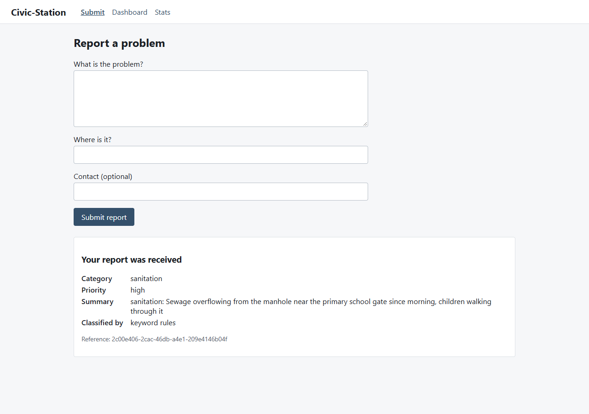
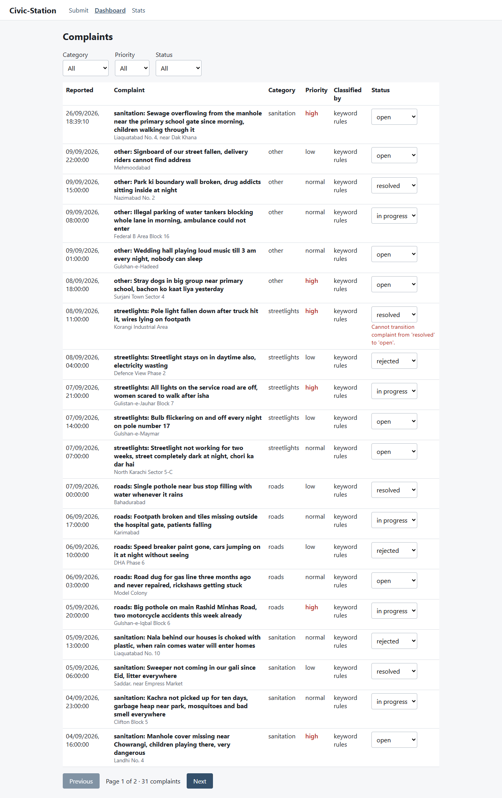
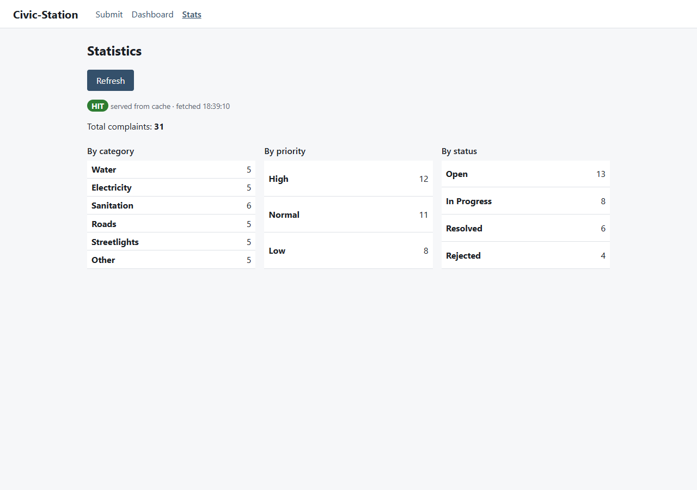

# Civic-Station

## Quickstart

Needs only Docker (Compose v2) and `make`. From a clean clone:

```sh
make up
```

That copies `.env.example` to `.env` if there is none, builds both images, runs the migration
and the seed as a one-shot `migrate` service, and waits until every service is healthy. Open
<http://civic-station.localhost:8080>. The default provider is `rules`, so no API key is needed.
Without `make`, run the same two steps by hand:

```sh
cp .env.example .env
docker compose up -d --build --wait
```

To use Groq, set `TRIAGE_PROVIDER=llm` and `GROQ_API_KEY` in `.env` (never in a committed file).
For offline triage with Ollama, pull the weights once, then start the profile:

```sh
make pull-models       # one-time, over the egress network (AD-046)
TRIAGE_PROVIDER=ollama docker compose --profile ollama up -d --wait
```

`docker compose down` stops the stack; add `-v` to drop the data volumes. Production uses
`compose.prod.yaml`, which runs SHA-tagged images only: `IMAGE_TAG=<sha> docker compose -f
compose.prod.yaml up -d --wait`.

## Kubernetes (local k3d)

Needs Docker, [`k3d`](https://k3d.io) and `kubectl`. One script creates the cluster, installs the
VPA recommender, creates the `app-secrets` Secret once, builds and imports the `:dev` images, and
applies the dev overlay:

```sh
sh scripts/k3d-up.sh
curl -H 'Host: civic-station.localhost' http://127.0.0.1:8081/api/version
```

The browser can open <http://civic-station.localhost:8081>. Manifests are under `k8s/`:
`base/` plus `overlays/dev` (simulated provider) and `overlays/prod` (Groq, image tags set to the
commit SHA by the pipeline). The committed `k8s/base/secret.example.yaml` holds placeholders
only and is never applied. To use Groq on the cluster, create the Secret with a real key before
running the script, as `secret.example.yaml` shows. `k3d cluster delete civic-station` removes
everything.

## Continuous delivery

`.github/workflows/cd.yml` runs on every push to `main`: the eight `ci.yml` jobs as `test`, then
`build-push` (both images to GHCR as `:<sha>` and `:latest`, an SPDX SBOM per image kept 90 days,
digests as job outputs), then `deploy-k8s`. The deploy job creates a k3d cluster in the runner,
deploys the previous `main` commit as a baseline, deploys the new SHA over it with
`scripts/deploy-k8s.sh`, and smoke-tests through the Ingress. If the smoke test fails, the job
runs `kubectl rollout undo` back to the baseline and exits red (`AD-065`). Run it by hand with
**Actions → CD → Run workflow**; tick `force_smoke_failure` to exercise the rollback.
`release.yml` publishes semver images, SBOMs and release notes on a `v*` tag.

One repository secret is required: **`GROQ_API_KEY`**, the bare `gsk_…` value with no quotes (Settings → Secrets and variables →
Actions). The deployed provider is `llm`, and the smoke test fails if triage falls back to rules.
Registry access uses the workflow's own `GITHUB_TOKEN`; no other credential exists.

## Database migrations and seed

The schema is created only by Alembic, never at application startup (`BR-DATA-001`). Both
commands run from `backend/` as a deliberate step, with `DATABASE_URL` in the environment:

```sh
uv run alembic upgrade head        # create or upgrade the schema
uv run python -m seeds.complaints  # load the 30 fixture complaints; safe to re-run
```

The seed is idempotent: ids are UUIDv5 over a fixed namespace and inserts use
`ON CONFLICT (id) DO NOTHING`, so a second run inserts nothing (`AD-022`).

Integration tests run against real PostgreSQL and Redis. They refuse any database whose name
does not end in `_test`, because they downgrade the schema:

```sh
DATABASE_URL=postgresql+asyncpg://<user>@<host>:<port>/civic_test \
REDIS_URL=redis://<host>:<port>/0 \
uv run pytest tests/integration
```

## Frontend API types

`frontend/src/api/types.ts` is generated from the backend's OpenAPI schema and committed; it is
never edited by hand (`FR-FE-012`). After any backend contract change, regenerate it and let
`tsc --noEmit` show what broke:

```sh
cd frontend && npm run gen:types   # exports the schema from the app factory; no server needed
npm run typecheck
```

## Screenshots

Captured from the running app (backend with `TRIAGE_PROVIDER=rules`, seeded database):

| Submit | Dashboard | Stats |
|---|---|---|
|  |  |  |

The dashboard shows the server's own 409 message after an attempted `resolved → open`; the stats
view shows `HIT` on the second load inside the 30-second TTL.

## Repository checks

```sh
python scripts/check_submission.py   # layer rules and frontend single-source-of-truth; exit 1 on findings
```

Standard library only. It walks the backend's AST for reverse imports, SQL or vendor SDKs outside
their layer, environment reads outside `app/config.py`, concrete triage classes outside
`providers/triage/`, and schema DDL outside migrations; and it scans `frontend/src/` for
hand-written enum lists or transition maps. Triage measurements behind `docs/TRIAGE.md` come from
`scripts/measure_triage.py`.
